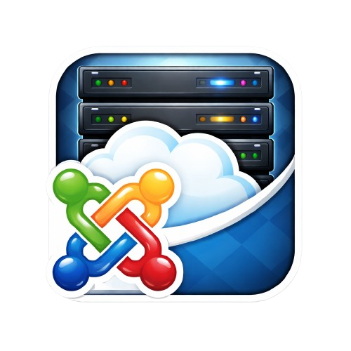

# Joomla MCP Server

A modern FastAPI-based server for controlling and interacting with the Joomla 4 Core API using natural language and external clients.



## Features

- Chat UI where users can write questions/commands in natural language and have them executed against Joomla.
- Tools for articles, users, menus, tags, and redirects.
- LLM (OpenAI) interprets the user's question and automatically selects the correct tool.
- Server-side guardrails to protect against destructive actions without confirmation.
- Exposes the same tools via the MCP protocol for external systems.

## Architecture

```
Browser UI (templates/index.html + static/chat.js)
     -> POST /chat
          -> src/routes/chat_router.py
               -> src/services/llm_service.py (OpenAI + tool schema)
               -> TOOL_MAP dispatch
               -> src/tools/*_tool.py
                    -> respective src/services/joomla_API/*_service.py
                         -> Joomla 4 Core API

External MCP client
     -> /mcp (FastMCP mount in main.py)
          -> src/tools/*_tool.py etc.
               -> respective src/services/joomla_API/*_service.py
                    -> Joomla 4 Core API
```

## Layer Responsibilities

- **llm_service.py**: Describes available tools according to the OpenAI function-calling schema.
- **chat_router.py**: Orchestrates the flow, handles confirmations, and maps tool names to the correct Python function.
- **tools/\*\_tool.py**: Implements domain-specific operations (articles, users, menus, etc.).
- **services/joomla_API/\*\_service.py**: Communicates directly with the Joomla 4 Core API.

## Adding a New Tool

1. Implement the function in the appropriate `src/tools/*_tool.py` file.
2. Add a schema entry in `OPENAI_TOOL_SCHEMAS` in `src/services/llm_service.py`.
3. Add a dispatch entry in `TOOL_MAP` in `src/routes/chat_router.py`.
4. If the tool is destructive, add its name to `DESTRUCTIVE_TOOLS` in `chat_router.py`.

## Endpoints

| Method | Endpoint         | Purpose                                                        |
| ------ | ---------------- | -------------------------------------------------------------- |
| GET    | `/`              | Renders the chat UI (index.html)                               |
| POST   | `/chat`          | Receives prompt, lets LLM choose tool, and performs Joomla ops |
| GET    | `/joomla-status` | Returns JSON with online-status and link for your joomla-site  |
| ASGI   | `/mcp`           | Exposes tools for external MCP clients                         |

## Logging

- Logging is configured in `src/config/logging_config.py` and initialized from `main.py`.
- Sensitive fields are masked before logging.
- Errors and events are logged for traceability.

## Development

- The project is modular and easy to extend with more tools/domains.
- Follow the checklist above to add new features.

## Project Structure

```text
├── DEPLOYMENT.md
├── Dockerfile
├── docker-compose.yml
├── docker-compose.prod.yml
├── main.py
├── pyproject.toml
├── uv.lock
├── templates/
│   └── index.html
├── static/
│   ├── chat.js
│   ├── style.css
│   └── favicon.ico
└── src/
     ├── config/
     │   └── logging_config.py
     ├── routes/
     │   └── chat_router.py
     ├── services/
     │   ├── joomla_API/
     │   │    ├── __init__.py
     │   │    └── *_service.py
     │   ├── __init__.py
     │   └── llm_service.py
     ├── tools/
     │   ├── __init__.py
     │   └── *_tool.py
     └── utils/
         ├── config.py
         └── formatters.py
```

## Getting Started

### Local Development (Direct)

#### 1. Install uv (if not already installed)

```bash
pip install uv
```

#### 2. Install Dependencies

```bash
uv sync
```

#### 3. Configure Environment

Copy `.env.example` and customize:

```bash
cp .env.example .env
```

Edit `.env` and set:

- `JOOMLA_SITE_URL` = `http://localhost:8080` (your local Joomla)
- `JOOMLA_API_URL` = `http://localhost:8080/api/index.php/v1`
- `JOOMLA_API_TOKEN` = your Joomla API token
- `OPENAI_API_KEY` = your OpenAI API key

#### 4. Start the Server

```bash
uv run main.py
```

Access at: `http://127.0.0.1:8000`

### Docker Development (Recommended)

#### 1. Configure Environment

```bash
cp .env.example .env
```

Edit `.env` with your Joomla and OpenAI credentials (see section below).

#### 2. Build and Run

```bash
docker compose up --build
```

Access at: `http://localhost:8000`

**Note:** The Docker dev setup automatically uses `host.docker.internal` to reach your local Joomla server, which is why `JOOMLA_SITE_URL` can remain `http://localhost:8080` in `.env`.

---

## Deployment to Production

For a detailed deployment checklist and troubleshooting guide, see [DEPLOYMENT.md](DEPLOYMENT.md).

### Prerequisites

- Docker and Docker Compose installed on your server
- A running Joomla 4 instance
- OpenAI API key
- A Joomla API token (System > Users > Create API Token)

### Deployment Steps

#### 1. Copy Project to Server

```bash
git clone https://github.com/kimpabooy/Joomla_MCP_Server /opt/joomla-mcp-server
cd /opt/joomla-mcp-server
```

#### 2. Create Production `.env`

```bash
cp .env.example .env
```

Edit `.env` with **production values** (CRITICAL):

```env
# Use your actual server domain/IP, NOT localhost
JOOMLA_SITE_URL="https://joomla.example.com"
JOOMLA_API_URL="https://joomla.example.com/api/index.php/v1"
JOOMLA_API_TOKEN="your-joomla-api-token"
OPENAI_API_KEY="sk-proj-your-key"
```

**Important:** In production, use your **actual domain or server IP**, not `localhost` or `host.docker.internal`.

**Local test of production compose:** If you run `docker-compose.prod.yml` on your local machine while Joomla is also running locally, keep `JOOMLA_SITE_URL` as your public/local browser URL (for display), and set:

```env
JOOMLA_SITE_CHECK_URL="http://host.docker.internal:8080"
```

This is needed because `localhost` inside the app container points to the container itself, not your host machine.

#### 3. Configure Production Docker Compose

```bash
docker compose -f docker-compose.prod.yml up -d
```

This uses the production settings:

- No development reload or source code volumes
- Health checks enabled
- Automatic restart policy
- Port 8000 exposed

#### 4. Access the Application

```
http://your-server-ip:8000
http://your-domain.com:8000 (if using domain)
```

### Environment Variable Reference

| Variable                | Local Dev                                | Production                                    | Notes                                    |
| ----------------------- | ---------------------------------------- | --------------------------------------------- | ---------------------------------------- |
| `JOOMLA_SITE_URL`       | `http://localhost:8080`                  | `https://joomla.example.com`                  | Use your actual domain in prod           |
| `JOOMLA_API_URL`        | `http://localhost:8080/api/index.php/v1` | `https://joomla.example.com/api/index.php/v1` | Root API endpoint                        |
| `JOOMLA_SITE_CHECK_URL` | Optional (auto-handled in dev compose)   | Optional override for status checks           | Useful when testing prod compose locally |
| `JOOMLA_API_TOKEN`      | Any valid token                          | Valid token with API perms                    | Generate in Joomla System > Users        |
| `OPENAI_API_KEY`        | Your key                                 | Your key                                      | Must be valid OpenAI API key             |

### Network Troubleshooting

**Symptom:** MCP Server shows "offline" despite Joomla being online.

**Solution:** Verify Joomla URLs from inside the container:

```bash
docker compose -f docker-compose.prod.yml exec app uv run python -c "import requests; print(requests.get('http://host.docker.internal:8080', timeout=5).status_code)"
```

In **production**, replace `host.docker.internal` with your actual server IP or domain.

---

## Dependencies

| Package         | Purpose                      |
| --------------- | ---------------------------- |
| `fastapi`       | Web framework                |
| `fastmcp`       | MCP server                   |
| `uvicorn`       | ASGI server                  |
| `jinja2`        | HTML templates               |
| `openai`        | LLM function calling         |
| `pydantic`      | Validation                   |
| `requests`      | Joomla HTTP calls            |
| `python-dotenv` | Environment variable loading |
